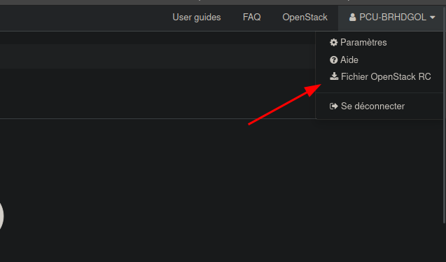

# Atelier Talos - Infomaniak

## Description

Ce projet est la synthèse du live [CuistOps](https://twitch.tv/cuistops) au thème de Talos *(une distribution immuable pour déployer des noeuds Kubernetes)*.

## Usage

### Pré-requis

- Un compte Infomaniak (ainsi qu'un projet cloud-public)
- La ligne de commande `openstack-client` installée


### Installation du client OpenStack

Pour installer le client OpenStack ainsi que le client Octavia (obligatoire pour la création de LoadBalancer), il suffit d'exécuter les commandes suivantes :

```bash
python3 -m pip install python-openstackclient --break-system-packages
python3 -m pip install python-octaviaclient --break-system-packages
```

### Récupérer les accès OpenStack

Se connecter à l'interface web Horizon d'Infomaniak et récupérer le script `openrc.sh` 



## FAQ

> Pourquoi passer par la ligne de commande pour piloter OpenStack plutôt que Terraform ?

L'objectif premier de cet atelier est de montrer la procédure étape par étape pour tous. L'usage de Terraform ne doit pas être un pré-requis pour suivre cet atelier. Ainsi, nous avons pris la décision de passer par l'utilitaire openstack-client pour piloter OpenStack.